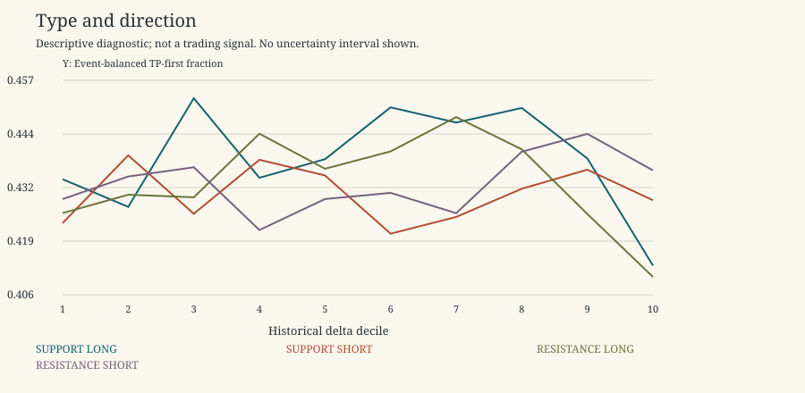

# 2023 Previously Inspected Replication

Descriptive research only. 2021-2022 is primary research; 2023 is a previously inspected replication period, not untouched validation. No 2024 data, p-values, independence claims, threshold selection, scores or live trading. Rates exclude censored horizons; ambiguous outcomes remain ambiguous. Gross expectancy is conditional on unambiguous resolved horizons and excludes costs.

Same descriptive design, six widths and outcome grid; no refitting using 2023. 2023 ECDFs are frozen whereas development ECDFs expand. That calibration-policy change can itself affect bucket membership. Quarterly labels naturally differ by year; do not merge them as the same quarter.

| kind | bucket | unique_event_count_development | unique_event_count_replication | delta_vs_A_alone_development | delta_vs_A_alone_replication | matched_incremental_tp_development | matched_incremental_tp_replication |
| --- | --- | --- | --- | --- | --- | --- | --- |
| RESISTANCE | 1 | 5070 | 2086 | -0.0335477 | -0.0100252 | -0.060049 | -0.0730174 |
| RESISTANCE | 10 | 5635 | 2036 | -0.0217163 | -0.025327 | 0.0112132 | 0.000494805 |
| RESISTANCE | 2 | 7128 | 2751 | -0.0168299 | -0.00562669 | -0.0347373 | -0.0523235 |
| RESISTANCE | 3 | 8416 | 3195 | -0.00439434 | -0.00624688 | -0.0151663 | -0.0409836 |
| RESISTANCE | 4 | 9208 | 3470 | -0.00120516 | 0.00899957 | -0.00537996 | -0.00260718 |
| RESISTANCE | 5 | 9899 | 3999 | 0.0052089 | 0.000600182 | 0.00145258 | -0.0133066 |
| RESISTANCE | 6 | 10700 | 4330 | 0.0118794 | 0.00475869 | 0.00682627 | -0.003246 |
| RESISTANCE | 7 | 9758 | 3653 | 0.008688 | 0.0129918 | 0.00642105 | 0.011548 |
| RESISTANCE | 8 | 8978 | 3476 | -0.00185324 | 0.00525749 | -0.00436983 | -0.00491046 |
| RESISTANCE | 9 | 7708 | 2914 | -0.00719488 | -0.0102561 | 0.00173657 | -0.00172236 |
| RESISTANCE | MISSING | 33 | 4 | 0.0499516 | -0.185445 | -1 | -0.25 |
| SUPPORT | 1 | 5258 | 2190 | -0.0282113 | -0.00408509 | -0.0546243 | -0.0777011 |
| SUPPORT | 10 | 5519 | 1790 | -0.0201656 | -0.0247672 | 0.00560957 | 0.00337458 |
| SUPPORT | 2 | 7367 | 2914 | -0.0141994 | -0.0107118 | -0.0336323 | -0.0596758 |
| SUPPORT | 3 | 8640 | 3360 | -0.00693662 | 0.0153318 | -0.016526 | -0.00747608 |
| SUPPORT | 4 | 9549 | 3719 | -0.00192711 | -0.00373543 | -0.00905758 | -0.0189445 |
| SUPPORT | 5 | 10140 | 4116 | 0.00488142 | 0.000719784 | -0.00475805 | -0.00732243 |
| SUPPORT | 6 | 10453 | 4068 | 0.00713334 | 0.0131468 | 0.00295072 | 0.0195255 |
| SUPPORT | 7 | 9433 | 3361 | 0.00887149 | 0.00950902 | 0.00707214 | 0.00119474 |
| SUPPORT | 8 | 8665 | 3101 | 0.00039939 | 0.0129969 | 0.00462963 | 0.0119702 |
| SUPPORT | 9 | 7449 | 2619 | -0.011126 | 0.000886286 | 0.000276205 | 0.0145817 |
| SUPPORT | MISSING | 24 | 4 | -0.0531954 | -0.187616 | -1 | -0.25 |

All replication breakdown reports are in data/phase35/replication/reports; complete comparison is replication-comparison.csv.

