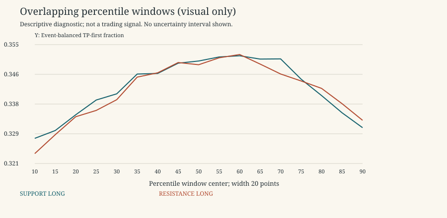
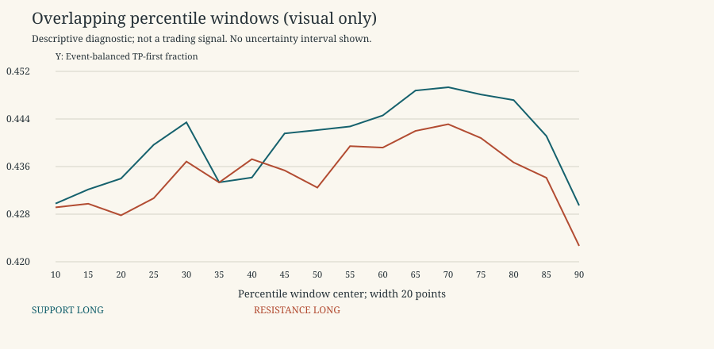

# Phase 3.5 Completion

Descriptive research only. 2021-2022 is primary research; 2023 is a previously inspected replication period, not untouched validation. No 2024 data, p-values, independence claims, threshold selection, scores or live trading. Rates exclude censored horizons; ambiguous outcomes remain ambiguous. Gross expectancy is conditional on unambiguous resolved horizons and excludes costs.

## Questions and Evidence

1. **Monotonic or nonlinear?** 0/432 sufficiently populated type/width/outcome decile curves are monotonic in all nine steps. Nonmonotonic descriptive curves do not establish a true nonlinear function; noise and subgroup composition remain explanations.

2. **Q3 stable or binning artifact?** Legacy Q3 is the highest displayed quartile in 91/288 separated type/width/outcome development settings (ties use fixed bucket order). This is a diagnostic of the prior observation, not selection. A Q3 maximum alone is not a stable continuous region; the boundaries were pooled across Phase 3 detectors/full development. Historical deciles and ECDF sensitivities below test a different, causal definition.

3. **Support or resistance?** Median within-curve max-minus-min event TP rate by type is {'RESISTANCE': 0.02445241361015, 'SUPPORT': 0.024131888949499997}. This measures descriptive variation, not predictive strength; matching, contexts and multiple comparisons prevent declaring one type universally more informative.

4. **LONG or SHORT?** The corresponding median curve ranges are {'LONG': 0.0230341735199, 'SHORT': 0.0257164731689}. Both directions exhibit the reported heterogeneity; ranges do not prove a directional edge or justify support=LONG/resistance=SHORT.

5. **Visit number?** Decile-10-minus-1 keeps one sign across available sufficiently populated visit groups in 181/288 comparable settings. Changes in the remaining settings mean that a pooled relationship does not transfer uniformly across visits. Full curves/counts accompany the contrast.

6. **Width sensitivity?** The same contrast keeps one sign across sufficiently populated widths in 41/48 comparable settings. Magnitudes and curves still vary; agreement shares events and is not independent replication. No width is selected.

7. **TP/SL robustness?** Contrast sign is consistent across the four existing pairs in 54/72 comparable settings. This is a sign-consistency diagnostic, not proof of survival after costs or of a winning pair.

8. **Decay with horizon?** Median/min/max decile contrast at 4/8/24 candles is shown below. A single universal decay time is not identified; changing ambiguous/censored composition and overlapping horizons preclude interpreting this as an execution horizon.

9. **Persistence across 2021-2022?** Contrast sign is consistent across sufficiently populated quarters in 13/288 comparable settings. Quarter reversals/heterogeneity are explicit evidence against treating a pooled shape as universally persistent; these are not independent significance tests.

10. **2023 similarity?** Development/replication high-minus-low signs agree in 118/288 comparable separated type/width/outcome settings. Similarities and differences are therefore quantifiable, but the exposed replication period and changed expanding/frozen calibration policy cannot validate a threshold.

11. **Incremental information beyond A alone?** The matched-A high-minus-low increment ranges from -0.0728578 to 0.101855, median 0.000627863. Subgroup-vs-A differences exist descriptively, but are not a demonstrated incremental predictive edge: reused controls, time dependence, composition and many comparisons remain. No significance claim is made.

12. **Enough evidence to freeze a rule?** This descriptive iteration alone does not justify an automatic rule freeze. No rule or candidate trading region is selected. Any later explicitly chosen simple hypothesis requires a later untouched test; 2024 remains unopened.

## Legacy Q3 Reconstruction (Development, Display Slice)

| bucket | unique_event_count | measurement_count | event_balanced_tp_first_rate | delta_vs_A_alone | matched_incremental_tp |
| --- | --- | --- | --- | --- | --- |
| 1 | 11111 | 229779 | 0.330782 | -0.0123204 | -0.0207512 |
| 2 | 15072 | 141611 | 0.344969 | 0.00186672 | -0.00509537 |
| 3 | 15437 | 143579 | 0.347742 | 0.00463881 | 0.00201925 |
| 4 | 11227 | 223446 | 0.337313 | -0.00578985 | 0.00240986 |
| MISSING | 6 | 644 | 0 | -0.343103 | -1 |

## Chronological Contrast (Display Slice, LONG)

| kind | facet_value | unique_event_count_low | unique_event_count_high | high_minus_low_event_tp | high_minus_low_matched_increment |
| --- | --- | --- | --- | --- | --- |
| RESISTANCE | 2021-Q1 | 496 | 487 | 0.0444583 | 0.079705 |
| RESISTANCE | 2021-Q2 | 759 | 876 | 0.0138205 | 0.0735143 |
| RESISTANCE | 2021-Q3 | 704 | 810 | 0.0418736 | 0.110953 |
| RESISTANCE | 2021-Q4 | 510 | 429 | 0.036775 | 0.106004 |
| RESISTANCE | 2022-Q1 | 675 | 814 | -0.0259914 | 0.046153 |
| RESISTANCE | 2022-Q2 | 619 | 738 | -0.00436056 | 0.074502 |
| RESISTANCE | 2022-Q3 | 775 | 887 | -0.00906717 | 0.0402572 |
| RESISTANCE | 2022-Q4 | 532 | 594 | 0.00815655 | 0.0689883 |
| SUPPORT | 2021-Q1 | 500 | 443 | 0.0450203 | 0.0774851 |
| SUPPORT | 2021-Q2 | 777 | 865 | 0.0193824 | 0.0829794 |
| SUPPORT | 2021-Q3 | 719 | 786 | 0.0334133 | 0.083774 |
| SUPPORT | 2021-Q4 | 490 | 407 | 0.0436043 | 0.0939545 |
| SUPPORT | 2022-Q1 | 683 | 821 | -0.0281091 | 0.0276238 |
| SUPPORT | 2022-Q2 | 688 | 762 | -0.0131043 | 0.0490173 |
| SUPPORT | 2022-Q3 | 797 | 831 | -0.0154007 | 0.0344918 |
| SUPPORT | 2022-Q4 | 604 | 604 | 0.00617073 | 0.0715324 |

## Horizon Contrast Across Settings

| horizon | median | min | max |
| --- | --- | --- | --- |
| 4 | 0.00466906 | -0.0165183 | 0.027144 |
| 8 | 0.0034315 | -0.0133144 | 0.0271698 |
| 24 | 0.00306341 | -0.0118354 | 0.0265237 |

## Artifacts and Limitations

Raw features: data/phase35/{development,replication}/features/*.parquet. Outcome data is separate. Summaries: summary.csv/parquet; contrasts.csv; curve-shapes.csv. Controls use indices into event-index.parquet, with mappings saved per width/type in summary-parts/*-controls.parquet. design.json and development-seal.json lock the descriptive process, not a trading rule.

All five development diagnostic reports and PHASE35_2023_REPLICATION.md accompany this document; detailed replication reports and plots are under data/phase35/replication/reports. No bootstrap intervals or significance claims were added. Sparse ventiles remain flagged. Full phase tests and final artifact checks are recorded in verification.json.

## Final Verification

210 tests passed; zero failures/errors. Original Phase 3 research code and source manifests are unchanged. All 840 legacy A/quartile/outcome rows reproduce Phase 3 counts and checked metrics across development and previously observed replication. Every saved matched-control link passed the past-horizon check. Both phases' reports reproduce byte-for-byte. Original raw archives are not modified.

PHASE35_RAW_DELTA.md reports the exact legacy boundaries and raw delta/quantity/sign composition, with all widths and types preserved in raw-delta-distribution.csv.

Overlapping-window plots below are visualization-only; their windows overlap and are not independent evidence or candidate rules.

Important: PHASE35_OUTCOME_COMPOSITION.md shows that the development middle-delta TP-first increase accompanies a SL-first increase and lower ambiguity. Do not equate the inverted-U TP-first display with directional edge.
