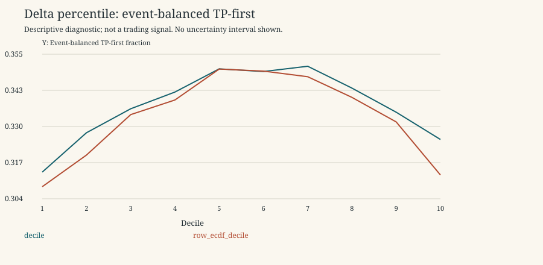
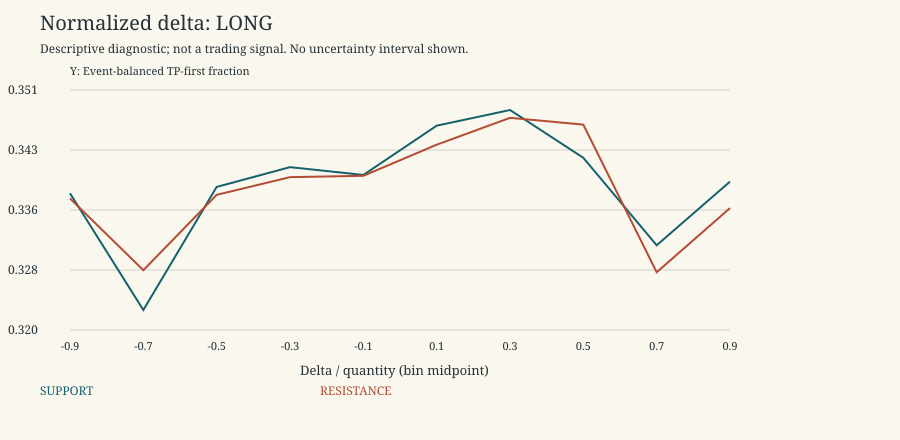

# Continuous Delta

Descriptive research only. 2021-2022 is primary research; 2023 is a previously inspected replication period, not untouched validation. No 2024 data, p-values, independence claims, threshold selection, scores or live trading. Rates exclude censored horizons; ambiguous outcomes remain ambiguous. Gross expectancy is conditional on unambiguous resolved horizons and excludes costs.

Period: 2021-2022 primary development

Display slice only: original half-width 0.004, TP=SL=0.003, horizon=8. Both types/directions remain separate. All widths and outcome combinations are in summary.csv/parquet. Empty/sparse buckets are retained and flagged, not promoted as discoveries.

Historical percentiles use event-balanced strictly past ECDFs in development and frozen development ECDFs in replication. Row ECDF and legacy pooled quartiles are separate sensitivities. The legacy label uses full-development boundaries and is not an online development feature.

| family | bucket | unique_event_count | measurement_count | event_balanced_tp_first_rate | delta_vs_A_alone | delta_vs_facet_A_alone | matched_complete_targets | unique_control_events | matched_incremental_tp |
| --- | --- | --- | --- | --- | --- | --- | --- | --- | --- |
| A_ALONE | ALL | 17340 | 739059 | 0.343103 | 0 | 0 | 16595 | 10860 | -0.00204881 |
| decile | 1 | 5729 | 118421 | 0.313832 | -0.0292711 | -0.0292711 | 5501 | 4035 | -0.0538084 |
| decile | 10 | 6144 | 118344 | 0.325358 | -0.0177447 | -0.0177447 | 5905 | 4218 | 0.0115157 |
| decile | 2 | 8415 | 68650 | 0.327746 | -0.0153567 | -0.0153567 | 8115 | 5806 | -0.031793 |
| decile | 3 | 10276 | 61462 | 0.336221 | -0.00688159 | -0.00688159 | 9938 | 6989 | -0.0165023 |
| decile | 4 | 11638 | 59094 | 0.342128 | -0.000974873 | -0.000974873 | 11238 | 7871 | -0.00809753 |
| decile | 5 | 12464 | 59200 | 0.350321 | 0.00721828 | 0.00721828 | 12094 | 8420 | 0.00132297 |
| decile | 6 | 13161 | 60318 | 0.349373 | 0.00627011 | 0.00627011 | 12753 | 8822 | 0.00274445 |
| decile | 7 | 11863 | 58850 | 0.35124 | 0.00813692 | 0.00813692 | 11503 | 7968 | 0.00417282 |
| decile | 8 | 10608 | 63537 | 0.343517 | 0.000414457 | 0.000414457 | 10252 | 7147 | -0.000682794 |
| decile | 9 | 8800 | 70439 | 0.335 | -0.00810275 | -0.00810275 | 8513 | 5983 | 0.000352402 |
| decile | MISSING | 37 | 744 | 0.351351 | 0.0082486 | 0.0082486 | 4 | 2 | -1 |
| legacy_quartile | 1 | 11111 | 229779 | 0.330782 | -0.0123204 | -0.0123204 | 10650 | 7329 | -0.0207512 |
| legacy_quartile | 2 | 15072 | 141611 | 0.344969 | 0.00186672 | 0.00186672 | 14523 | 9756 | -0.00509537 |
| legacy_quartile | 3 | 15437 | 143579 | 0.347742 | 0.00463881 | 0.00463881 | 14857 | 9954 | 0.00201925 |
| legacy_quartile | 4 | 11227 | 223446 | 0.337313 | -0.00578985 | -0.00578985 | 10789 | 7349 | 0.00240986 |
| legacy_quartile | MISSING | 6 | 644 | 0 | -0.343103 | -0.343103 | 4 | 2 | -1 |
| normalized_delta | 1 | 4993 | 13617 | 0.339676 | -0.00342721 | -0.00342721 | 4874 | 3736 | -0.0209274 |
| normalized_delta | 10 | 4732 | 12986 | 0.333686 | -0.00941721 | -0.00941721 | 4635 | 3553 | -0.00647249 |
| normalized_delta | 2 | 4486 | 9854 | 0.33103 | -0.0120729 | -0.0120729 | 4391 | 3409 | -0.0382601 |
| normalized_delta | 3 | 7363 | 23023 | 0.338089 | -0.00501334 | -0.00501334 | 7175 | 5235 | -0.0287108 |
| normalized_delta | 4 | 11480 | 68494 | 0.341264 | -0.00183914 | -0.00183914 | 11102 | 7659 | -0.0139614 |
| normalized_delta | 5 | 14887 | 264692 | 0.34039 | -0.00271297 | -0.00271297 | 14317 | 9612 | -0.0083118 |
| normalized_delta | 6 | 14885 | 254384 | 0.343975 | 0.000871978 | 0.000871978 | 14310 | 9593 | 0.00300489 |
| normalized_delta | 7 | 11057 | 62137 | 0.348589 | 0.00548625 | 0.00548625 | 10706 | 7418 | 0.00523071 |
| normalized_delta | 8 | 6802 | 20331 | 0.344458 | 0.00135476 | 0.00135476 | 6635 | 4861 | 0.00165787 |
| normalized_delta | 9 | 4146 | 8897 | 0.328751 | -0.0143521 | -0.0143521 | 4067 | 3152 | -0.00786821 |
| normalized_delta | MISSING | 6 | 644 | 0 | -0.343103 | -0.343103 | 4 | 2 | -1 |
| normalized_sign_0.05 | MISSING | 6 | 644 | 0 | -0.343103 | -0.343103 | 4 | 2 | -1 |
| normalized_sign_0.05 | NEAR_ZERO | 12641 | 162530 | 0.340931 | -0.00217208 | -0.00217208 | 12149 | 8368 | 0.00123467 |
| normalized_sign_0.05 | NEGATIVE | 15643 | 296901 | 0.341136 | -0.00196691 | -0.00196691 | 15025 | 9981 | -0.00898502 |
| normalized_sign_0.05 | POSITIVE | 15541 | 278984 | 0.345349 | 0.00224646 | 0.00224646 | 14932 | 9929 | 0.00388428 |
| quartile | 1 | 10513 | 217984 | 0.32848 | -0.0146224 | -0.0146224 | 10103 | 6995 | -0.0243492 |
| quartile | 2 | 15121 | 148843 | 0.344447 | 0.0013439 | 0.0013439 | 14564 | 9769 | -0.00556166 |
| quartile | 3 | 15577 | 150133 | 0.346863 | 0.00376001 | 0.00376001 | 15019 | 10048 | 0.00086557 |
| quartile | 4 | 11087 | 221355 | 0.334235 | -0.0088673 | -0.0088673 | 10656 | 7248 | 0.000844595 |
| quartile | MISSING | 37 | 744 | 0.351351 | 0.0082486 | 0.0082486 | 4 | 2 | -1 |
| row_ecdf_decile | 1 | 4462 | 91641 | 0.308675 | -0.0344276 | -0.0344276 | 4261 | 3201 | -0.0668857 |
| row_ecdf_decile | 10 | 5150 | 97483 | 0.312816 | -0.0302872 | -0.0302872 | 4919 | 3589 | 0.00670868 |
| row_ecdf_decile | 2 | 7400 | 68759 | 0.319859 | -0.0232433 | -0.0232433 | 7111 | 5147 | -0.04261 |
| row_ecdf_decile | 3 | 9748 | 65936 | 0.334154 | -0.0089484 | -0.0089484 | 9424 | 6641 | -0.0221774 |
| row_ecdf_decile | 4 | 11682 | 67124 | 0.339327 | -0.00377575 | -0.00377575 | 11322 | 7894 | -0.0103339 |
| row_ecdf_decile | 5 | 12955 | 68846 | 0.350243 | 0.00714047 | 0.00714047 | 12544 | 8674 | 7.97194e-05 |
| row_ecdf_decile | 6 | 13679 | 70054 | 0.349521 | 0.0064182 | 0.0064182 | 13265 | 9093 | 0.00173389 |
| row_ecdf_decile | 7 | 12182 | 67412 | 0.34754 | 0.00443769 | 0.00443769 | 11780 | 8117 | -0.000254669 |
| row_ecdf_decile | 8 | 10431 | 68531 | 0.340238 | -0.00286493 | -0.00286493 | 10063 | 6986 | 0.0022856 |
| row_ecdf_decile | 9 | 8104 | 72529 | 0.331565 | -0.0115381 | -0.0115381 | 7809 | 5489 | 0.00537841 |
| row_ecdf_decile | MISSING | 37 | 744 | 0.351351 | 0.0082486 | 0.0082486 | 4 | 2 | -1 |
| ventile | 1 | 3601 | 75665 | 0.310556 | -0.0325472 | -0.0325472 | 3472 | 2666 | -0.0760369 |
| ventile | 10 | 9726 | 29727 | 0.349002 | 0.00589951 | 0.00589951 | 9454 | 6857 | -0.00200973 |
| ventile | 11 | 10422 | 30159 | 0.352755 | 0.0096521 | 0.0096521 | 10127 | 7339 | 0.000888713 |
| ventile | 12 | 9754 | 30159 | 0.351318 | 0.00821533 | 0.00821533 | 9479 | 6869 | 0.00643528 |
| ventile | 13 | 9322 | 29480 | 0.355372 | 0.0122691 | 0.0122691 | 9065 | 6532 | 0.00948704 |
| ventile | 14 | 8823 | 29370 | 0.347925 | 0.00482195 | 0.00482195 | 8584 | 6197 | -0.00174744 |
| ventile | 15 | 8453 | 30965 | 0.340078 | -0.00302465 | -0.00302465 | 8222 | 5977 | -0.00863537 |
| ventile | 16 | 8013 | 32572 | 0.33816 | -0.00494272 | -0.00494272 | 7753 | 5607 | 0.00180575 |
| ventile | 17 | 7338 | 33443 | 0.340965 | -0.00213791 | -0.00213791 | 7116 | 5193 | 0.00674536 |
| ventile | 18 | 6521 | 36996 | 0.333231 | -0.00987165 | -0.00987165 | 6332 | 4591 | 0.0050537 |
| ventile | 19 | 5585 | 44496 | 0.327663 | -0.0154394 | -0.0154394 | 5393 | 3939 | 0.0124235 |
| ventile | 2 | 5244 | 42756 | 0.315207 | -0.0278957 | -0.0278957 | 5057 | 3789 | -0.0522049 |
| ventile | 20 | 3886 | 73848 | 0.306742 | -0.0363606 | -0.0363606 | 3752 | 2793 | 0.000799574 |
| ventile | 3 | 6237 | 35572 | 0.316971 | -0.0261313 | -0.0261313 | 6039 | 4495 | -0.0496771 |
| ventile | 4 | 7096 | 33078 | 0.328775 | -0.0143279 | -0.0143279 | 6868 | 5059 | -0.0339255 |
| ventile | 5 | 7673 | 30913 | 0.332942 | -0.0101605 | -0.0101605 | 7453 | 5476 | -0.0220046 |
| ventile | 6 | 8304 | 30549 | 0.336545 | -0.00655734 | -0.00655734 | 8052 | 5851 | -0.0171386 |
| ventile | 7 | 8705 | 29519 | 0.340802 | -0.00230073 | -0.00230073 | 8445 | 6164 | -0.0098283 |
| ventile | 8 | 9030 | 29575 | 0.345591 | 0.00248874 | 0.00248874 | 8746 | 6366 | -0.00445918 |
| ventile | 9 | 9340 | 29473 | 0.350541 | 0.00743811 | 0.00743811 | 9102 | 6611 | 0.000769062 |
| ventile | MISSING | 37 | 744 | 0.351351 | 0.0082486 | 0.0082486 | 4 | 2 | -1 |

Normalized bucket j covers [-1+0.2*(j-1), -1+0.2*j), with +1 included in bucket 10. Normalized zero-volume rows are MISSING, not balanced flow.

