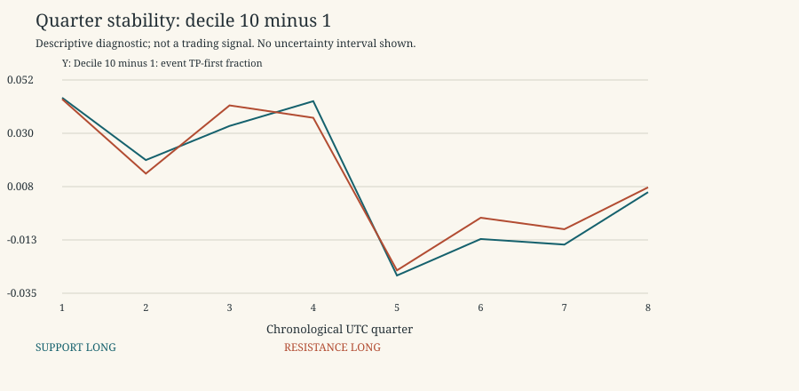

# Regime and Chronological Stability

Descriptive research only. 2021-2022 is primary research; 2023 is a previously inspected replication period, not untouched validation. No 2024 data, p-values, independence claims, threshold selection, scores or live trading. Rates exclude censored horizons; ambiguous outcomes remain ambiguous. Gross expectancy is conditional on unambiguous resolved horizons and excludes costs.

Period: 2021-2022 primary development

Display slice only: original half-width 0.004, TP=SL=0.003, horizon=8. Both types/directions remain separate. All widths and outcome combinations are in summary.csv/parquet. Empty/sparse buckets are retained and flagged, not promoted as discoveries.

Regimes use January 2021 price-only fits. Earlier rows are CALIBRATION; matched controls are unavailable there. Calendar-quarter splits are deterministic and never shuffled.

| kind | direction | facet | facet_value | unique_event_count_low | unique_event_count_high | high_minus_low_event_tp | high_minus_low_matched_increment |
| --- | --- | --- | --- | --- | --- | --- | --- |
| RESISTANCE | LONG | quarter | 2021-Q1 | 496 | 487 | 0.0444583 | 0.079705 |
| RESISTANCE | SHORT | quarter | 2021-Q1 | 496 | 487 | -0.00680185 | -0.00144362 |
| RESISTANCE | LONG | quarter | 2021-Q2 | 759 | 876 | 0.0138205 | 0.0735143 |
| RESISTANCE | SHORT | quarter | 2021-Q2 | 759 | 876 | -0.00541448 | -0.0289632 |
| RESISTANCE | LONG | quarter | 2021-Q3 | 704 | 810 | 0.0418736 | 0.110953 |
| RESISTANCE | SHORT | quarter | 2021-Q3 | 704 | 810 | 0.0208474 | -0.0305743 |
| RESISTANCE | LONG | quarter | 2021-Q4 | 510 | 429 | 0.036775 | 0.106004 |
| RESISTANCE | SHORT | quarter | 2021-Q4 | 510 | 429 | 0.00577266 | -0.0846288 |
| RESISTANCE | LONG | quarter | 2022-Q1 | 675 | 814 | -0.0259914 | 0.046153 |
| RESISTANCE | SHORT | quarter | 2022-Q1 | 675 | 814 | 0.0321103 | -0.0457007 |
| RESISTANCE | LONG | quarter | 2022-Q2 | 619 | 738 | -0.00436056 | 0.074502 |
| RESISTANCE | SHORT | quarter | 2022-Q2 | 619 | 738 | 0.0151306 | -0.0390441 |
| RESISTANCE | LONG | quarter | 2022-Q3 | 775 | 887 | -0.00906717 | 0.0402572 |
| RESISTANCE | SHORT | quarter | 2022-Q3 | 775 | 887 | -0.00197694 | -0.0541013 |
| RESISTANCE | LONG | quarter | 2022-Q4 | 532 | 594 | 0.00815655 | 0.0689883 |
| RESISTANCE | SHORT | quarter | 2022-Q4 | 532 | 594 | -0.0265191 | -0.088428 |
| RESISTANCE | LONG | return_regime | CALIBRATION | 165 | 180 | 0.0560606 | NA |
| RESISTANCE | SHORT | return_regime | CALIBRATION | 165 | 180 | -0.030303 | NA |
| RESISTANCE | LONG | return_regime | NEGATIVE | 1661 | 1330 | 0.000635544 | 0.0492474 |
| RESISTANCE | SHORT | return_regime | NEGATIVE | 1661 | 1330 | 0.00789542 | -0.01632 |
| RESISTANCE | LONG | return_regime | NEUTRAL | 2158 | 2426 | 0.0328535 | 0.097516 |
| RESISTANCE | SHORT | return_regime | NEUTRAL | 2158 | 2426 | -0.0116323 | -0.0702163 |
| RESISTANCE | LONG | return_regime | POSITIVE | 1086 | 1699 | -0.0188893 | 0.0072295 |
| RESISTANCE | SHORT | return_regime | POSITIVE | 1086 | 1699 | 0.014992 | 0.0120782 |
| RESISTANCE | LONG | volatility_regime | CALIBRATION | 165 | 180 | 0.0560606 | NA |
| RESISTANCE | SHORT | volatility_regime | CALIBRATION | 165 | 180 | -0.030303 | NA |
| RESISTANCE | LONG | volatility_regime | HIGH | 118 | 188 | -0.0292102 | 0 |
| RESISTANCE | SHORT | volatility_regime | HIGH | 118 | 188 | 0.0460692 | 0.119084 |
| RESISTANCE | LONG | volatility_regime | LOW | 4165 | 4462 | 0.0245449 | 0.086025 |
| RESISTANCE | SHORT | volatility_regime | LOW | 4165 | 4462 | 0.0108234 | -0.062538 |
| RESISTANCE | LONG | volatility_regime | MIDDLE | 622 | 805 | -0.0307803 | -0.00786007 |
| RESISTANCE | SHORT | volatility_regime | MIDDLE | 622 | 805 | 0.0181083 | 0.014134 |
| SUPPORT | LONG | quarter | 2021-Q1 | 500 | 443 | 0.0450203 | 0.0774851 |
| SUPPORT | SHORT | quarter | 2021-Q1 | 500 | 443 | -0.0169571 | -0.0246184 |
| SUPPORT | LONG | quarter | 2021-Q2 | 777 | 865 | 0.0193824 | 0.0829794 |
| SUPPORT | SHORT | quarter | 2021-Q2 | 777 | 865 | -0.00709859 | -0.0301541 |
| SUPPORT | LONG | quarter | 2021-Q3 | 719 | 786 | 0.0334133 | 0.083774 |
| SUPPORT | SHORT | quarter | 2021-Q3 | 719 | 786 | 0.0161714 | -0.0221303 |
| SUPPORT | LONG | quarter | 2021-Q4 | 490 | 407 | 0.0436043 | 0.0939545 |
| SUPPORT | SHORT | quarter | 2021-Q4 | 490 | 407 | 0.0154089 | -0.0655392 |
| SUPPORT | LONG | quarter | 2022-Q1 | 683 | 821 | -0.0281091 | 0.0276238 |
| SUPPORT | SHORT | quarter | 2022-Q1 | 683 | 821 | 0.0257676 | -0.0317272 |
| SUPPORT | LONG | quarter | 2022-Q2 | 688 | 762 | -0.0131043 | 0.0490173 |
| SUPPORT | SHORT | quarter | 2022-Q2 | 688 | 762 | 0.0201276 | -0.045987 |
| SUPPORT | LONG | quarter | 2022-Q3 | 797 | 831 | -0.0154007 | 0.0344918 |
| SUPPORT | SHORT | quarter | 2022-Q3 | 797 | 831 | -0.0237216 | -0.0812116 |
| SUPPORT | LONG | quarter | 2022-Q4 | 604 | 604 | 0.00617073 | 0.0715324 |
| SUPPORT | SHORT | quarter | 2022-Q4 | 604 | 604 | -0.0153111 | -0.0879728 |
| SUPPORT | LONG | return_regime | CALIBRATION | 179 | 157 | 0.00918051 | NA |
| SUPPORT | SHORT | return_regime | CALIBRATION | 179 | 157 | -0.0114934 | NA |
| SUPPORT | LONG | return_regime | NEGATIVE | 1786 | 1383 | -0.00759664 | 0.0313439 |
| SUPPORT | SHORT | return_regime | NEGATIVE | 1786 | 1383 | 0.00582623 | -0.0154016 |
| SUPPORT | LONG | return_regime | NEUTRAL | 2251 | 2373 | 0.030606 | 0.088995 |
| SUPPORT | SHORT | return_regime | NEUTRAL | 2251 | 2373 | -0.018606 | -0.0747752 |
| SUPPORT | LONG | return_regime | POSITIVE | 1042 | 1606 | -0.0182366 | -0.00366257 |
| SUPPORT | SHORT | return_regime | POSITIVE | 1042 | 1606 | 0.0101718 | 0.0125168 |
| SUPPORT | LONG | volatility_regime | CALIBRATION | 179 | 157 | 0.00918051 | NA |
| SUPPORT | SHORT | volatility_regime | CALIBRATION | 179 | 157 | -0.0114934 | NA |
| SUPPORT | LONG | volatility_regime | HIGH | 135 | 207 | -0.0270531 | -0.0329779 |
| SUPPORT | SHORT | volatility_regime | HIGH | 135 | 207 | 0.0173913 | 0.0675552 |
| SUPPORT | LONG | volatility_regime | LOW | 4286 | 4356 | 0.0190494 | 0.0736283 |
| SUPPORT | SHORT | volatility_regime | LOW | 4286 | 4356 | 0.00670749 | -0.0585271 |
| SUPPORT | LONG | volatility_regime | MIDDLE | 658 | 799 | -0.0177007 | -0.00373623 |
| SUPPORT | SHORT | volatility_regime | MIDDLE | 658 | 799 | 0.0123368 | -0.0131572 |

