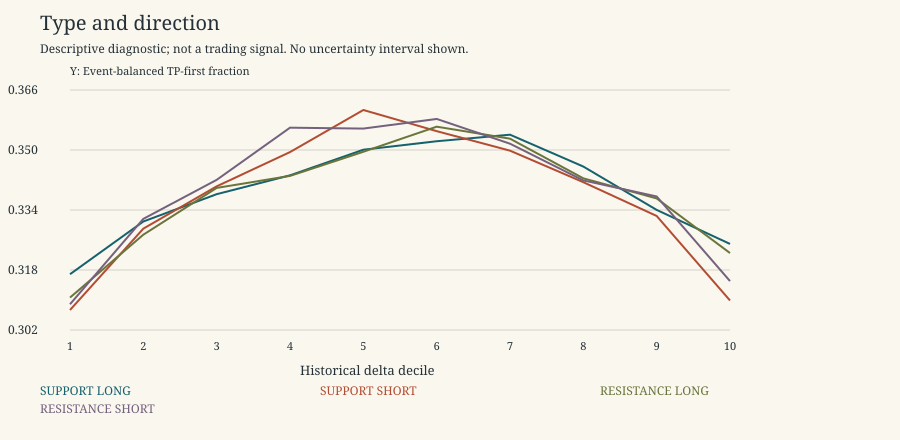

# Support and Resistance

Descriptive research only. 2021-2022 is primary research; 2023 is a previously inspected replication period, not untouched validation. No 2024 data, p-values, independence claims, threshold selection, scores or live trading. Rates exclude censored horizons; ambiguous outcomes remain ambiguous. Gross expectancy is conditional on unambiguous resolved horizons and excludes costs.

Period: 2021-2022 primary development

Display slice only: original half-width 0.004, TP=SL=0.003, horizon=8. Both types/directions remain separate. All widths and outcome combinations are in summary.csv/parquet. Empty/sparse buckets are retained and flagged, not promoted as discoveries.

| kind | direction | family | bucket | unique_event_count | measurement_count | event_balanced_tp_first_rate | delta_vs_A_alone | delta_vs_facet_A_alone | matched_complete_targets | unique_control_events | matched_incremental_tp |
| --- | --- | --- | --- | --- | --- | --- | --- | --- | --- | --- | --- |
| RESISTANCE | LONG | A_ALONE | ALL | 17089 | 369313 | 0.343988 | 0 | 0 | 16367 | 10681 | 0.000122197 |
| RESISTANCE | SHORT | A_ALONE | ALL | 17089 | 369313 | 0.34592 | 0 | 0 | 16367 | 10681 | -0.00769842 |
| RESISTANCE | LONG | normalized_sign_0.05 | MISSING | 5 | 307 | 0 | -0.343988 | -0.343988 | 3 | 2 | -1 |
| RESISTANCE | SHORT | normalized_sign_0.05 | MISSING | 5 | 307 | 0.2 | -0.14592 | -0.14592 | 3 | 2 | 0.333333 |
| RESISTANCE | LONG | normalized_sign_0.05 | NEAR_ZERO | 11201 | 81084 | 0.33905 | -0.00493816 | -0.00493816 | 10798 | 7533 | 0.000463049 |
| RESISTANCE | SHORT | normalized_sign_0.05 | NEAR_ZERO | 11201 | 81084 | 0.343158 | -0.00276141 | -0.00276141 | 10798 | 7533 | -0.0129654 |
| RESISTANCE | LONG | normalized_sign_0.05 | NEGATIVE | 14228 | 145026 | 0.34081 | -0.00317781 | -0.00317781 | 13700 | 9189 | -0.00890511 |
| RESISTANCE | SHORT | normalized_sign_0.05 | NEGATIVE | 14228 | 145026 | 0.34981 | 0.00389047 | 0.00389047 | 13700 | 9189 | 0.000510949 |
| RESISTANCE | LONG | normalized_sign_0.05 | POSITIVE | 14487 | 142896 | 0.346937 | 0.00294954 | 0.00294954 | 13955 | 9329 | 0.00601935 |
| RESISTANCE | SHORT | normalized_sign_0.05 | POSITIVE | 14487 | 142896 | 0.345142 | -0.000777771 | -0.000777771 | 13955 | 9329 | -0.0134002 |
| SUPPORT | LONG | A_ALONE | ALL | 17008 | 369746 | 0.344862 | 0 | 0 | 16335 | 10639 | -0.00440771 |
| SUPPORT | SHORT | A_ALONE | ALL | 17008 | 369746 | 0.345039 | 0 | 0 | 16335 | 10639 | -0.00287726 |
| SUPPORT | LONG | normalized_sign_0.05 | MISSING | 6 | 337 | 0 | -0.344862 | -0.344862 | 4 | 2 | -1 |
| SUPPORT | SHORT | normalized_sign_0.05 | MISSING | 6 | 337 | 0.166667 | -0.178372 | -0.178372 | 4 | 2 | 0.25 |
| SUPPORT | LONG | normalized_sign_0.05 | NEAR_ZERO | 11043 | 81446 | 0.340821 | -0.00404149 | -0.00404149 | 10674 | 7430 | -0.00103054 |
| SUPPORT | SHORT | normalized_sign_0.05 | NEAR_ZERO | 11043 | 81446 | 0.338103 | -0.00693509 | -0.00693509 | 10674 | 7430 | -0.0155518 |
| SUPPORT | LONG | normalized_sign_0.05 | NEGATIVE | 14664 | 151875 | 0.34152 | -0.00334208 | -0.00334208 | 14149 | 9439 | -0.0130045 |
| SUPPORT | SHORT | normalized_sign_0.05 | NEGATIVE | 14664 | 151875 | 0.348956 | 0.00391767 | 0.00391767 | 14149 | 9439 | 0.00296841 |
| SUPPORT | LONG | normalized_sign_0.05 | POSITIVE | 14059 | 136088 | 0.34683 | 0.00196779 | 0.00196779 | 13589 | 9099 | 0.00279638 |
| SUPPORT | SHORT | normalized_sign_0.05 | POSITIVE | 14059 | 136088 | 0.344339 | -0.00069924 | -0.00069924 | 13589 | 9099 | -0.0115535 |

The fixed near-zero normalized interval is [-0.05,0.05]; sensitivities 0/0.01/0.10 and raw sign are in the full table. No microstructure explanation is imposed.

