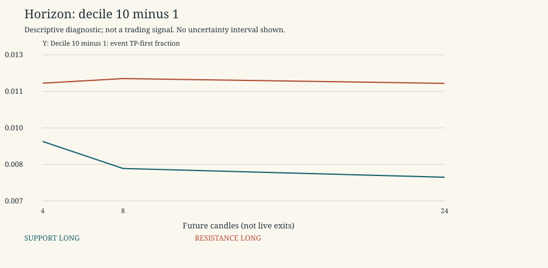

# TP SL and Horizon

Descriptive research only. 2021-2022 is primary research; 2023 is a previously inspected replication period, not untouched validation. No 2024 data, p-values, independence claims, threshold selection, scores or live trading. Rates exclude censored horizons; ambiguous outcomes remain ambiguous. Gross expectancy is conditional on unambiguous resolved horizons and excludes costs.

Period: 2021-2022 primary development

Display slice only: original half-width 0.004, TP=SL=0.003, horizon=8. Both types/directions remain separate. All widths and outcome combinations are in summary.csv/parquet. Empty/sparse buckets are retained and flagged, not promoted as discoveries.

| kind | direction | tp | sl | horizon | unique_event_count_low | unique_event_count_high | high_minus_low_event_tp | high_minus_low_matched_increment |
| --- | --- | --- | --- | --- | --- | --- | --- | --- |
| RESISTANCE | LONG | 0.003 | 0.003 | 4 | 5070 | 5635 | 0.0116382 | 0.0650644 |
| RESISTANCE | LONG | 0.003 | 0.003 | 8 | 5070 | 5635 | 0.0118314 | 0.0712623 |
| RESISTANCE | LONG | 0.003 | 0.003 | 24 | 5070 | 5635 | 0.0116295 | 0.0643208 |
| RESISTANCE | LONG | 0.003 | 0.005 | 4 | 5070 | 5635 | 0.0196738 | 0.0745661 |
| RESISTANCE | LONG | 0.003 | 0.005 | 8 | 5070 | 5635 | 0.0207998 | 0.0912377 |
| RESISTANCE | LONG | 0.003 | 0.005 | 24 | 5070 | 5635 | 0.0203215 | 0.0710245 |
| RESISTANCE | LONG | 0.005 | 0.003 | 4 | 5070 | 5635 | 0.0132709 | 0.063516 |
| RESISTANCE | LONG | 0.005 | 0.003 | 8 | 5070 | 5635 | 0.0119321 | 0.0661356 |
| RESISTANCE | LONG | 0.005 | 0.003 | 24 | 5070 | 5635 | 0.011299 | 0.0598315 |
| RESISTANCE | LONG | 0.005 | 0.005 | 4 | 5070 | 5635 | 0.0152328 | 0.060779 |
| RESISTANCE | LONG | 0.005 | 0.005 | 8 | 5070 | 5635 | 0.0141774 | 0.0802288 |
| RESISTANCE | LONG | 0.005 | 0.005 | 24 | 5070 | 5635 | 0.0119344 | 0.0653241 |
| RESISTANCE | SHORT | 0.003 | 0.003 | 4 | 5070 | 5635 | 0.00643472 | -0.0347111 |
| RESISTANCE | SHORT | 0.003 | 0.003 | 8 | 5070 | 5635 | 0.0061542 | -0.046201 |
| RESISTANCE | SHORT | 0.003 | 0.003 | 24 | 5070 | 5635 | 0.00585143 | -0.0407159 |
| RESISTANCE | SHORT | 0.003 | 0.005 | 4 | 5070 | 5635 | -0.0121054 | -0.0552746 |
| RESISTANCE | SHORT | 0.003 | 0.005 | 8 | 5070 | 5635 | -0.0122286 | -0.0615809 |
| RESISTANCE | SHORT | 0.003 | 0.005 | 24 | 5070 | 5635 | -0.0100269 | -0.0547604 |
| RESISTANCE | SHORT | 0.005 | 0.003 | 4 | 5070 | 5635 | -0.000338992 | -0.0379541 |
| RESISTANCE | SHORT | 0.005 | 0.003 | 8 | 5070 | 5635 | -0.00169904 | -0.0605596 |
| RESISTANCE | SHORT | 0.005 | 0.003 | 24 | 5070 | 5635 | -0.000124902 | -0.0486251 |
| RESISTANCE | SHORT | 0.005 | 0.005 | 4 | 5070 | 5635 | -0.0104779 | -0.0482486 |
| RESISTANCE | SHORT | 0.005 | 0.005 | 8 | 5070 | 5635 | -0.00911369 | -0.0681373 |
| RESISTANCE | SHORT | 0.005 | 0.005 | 24 | 5070 | 5635 | -0.00464722 | -0.0544762 |
| SUPPORT | LONG | 0.003 | 0.003 | 4 | 5258 | 5519 | 0.00918416 | 0.058432 |
| SUPPORT | LONG | 0.003 | 0.003 | 8 | 5258 | 5519 | 0.00804569 | 0.0602339 |
| SUPPORT | LONG | 0.003 | 0.003 | 24 | 5258 | 5519 | 0.0076771 | 0.0542651 |
| SUPPORT | LONG | 0.003 | 0.005 | 4 | 5258 | 5519 | 0.027144 | 0.0816914 |
| SUPPORT | LONG | 0.003 | 0.005 | 8 | 5258 | 5519 | 0.0263753 | 0.0919979 |
| SUPPORT | LONG | 0.003 | 0.005 | 24 | 5258 | 5519 | 0.025414 | 0.0723813 |
| SUPPORT | LONG | 0.005 | 0.003 | 4 | 5258 | 5519 | 0.00850652 | 0.0522489 |
| SUPPORT | LONG | 0.005 | 0.003 | 8 | 5258 | 5519 | 0.00609933 | 0.0516326 |
| SUPPORT | LONG | 0.005 | 0.003 | 24 | 5258 | 5519 | 0.0057039 | 0.0470708 |
| SUPPORT | LONG | 0.005 | 0.005 | 4 | 5258 | 5519 | 0.0210406 | 0.064086 |
| SUPPORT | LONG | 0.005 | 0.005 | 8 | 5258 | 5519 | 0.018962 | 0.0801298 |
| SUPPORT | LONG | 0.005 | 0.005 | 24 | 5258 | 5519 | 0.0163909 | 0.0646594 |
| SUPPORT | SHORT | 0.003 | 0.003 | 4 | 5258 | 5519 | 0.00200022 | -0.0378476 |
| SUPPORT | SHORT | 0.003 | 0.003 | 8 | 5258 | 5519 | 0.00252149 | -0.0478204 |
| SUPPORT | SHORT | 0.003 | 0.003 | 24 | 5258 | 5519 | 0.00218555 | -0.0427015 |
| SUPPORT | SHORT | 0.003 | 0.005 | 4 | 5258 | 5519 | -0.00846088 | -0.0488716 |
| SUPPORT | SHORT | 0.003 | 0.005 | 8 | 5258 | 5519 | -0.00821847 | -0.0504438 |
| SUPPORT | SHORT | 0.003 | 0.005 | 24 | 5258 | 5519 | -0.00695966 | -0.0460144 |
| SUPPORT | SHORT | 0.005 | 0.003 | 4 | 5258 | 5519 | -0.00646004 | -0.0440204 |
| SUPPORT | SHORT | 0.005 | 0.003 | 8 | 5258 | 5519 | -0.00739082 | -0.0631878 |
| SUPPORT | SHORT | 0.005 | 0.003 | 24 | 5258 | 5519 | -0.00649482 | -0.0532381 |
| SUPPORT | SHORT | 0.005 | 0.005 | 4 | 5258 | 5519 | -0.011901 | -0.0492261 |
| SUPPORT | SHORT | 0.005 | 0.005 | 8 | 5258 | 5519 | -0.00996199 | -0.0631148 |
| SUPPORT | SHORT | 0.005 | 0.005 | 24 | 5258 | 5519 | -0.00736423 | -0.0523007 |

Gross expectancy in full summaries conditions on resolved outcomes and is not total return. The horizon is not a mandatory live exit. Width robustness is available for all six configurations in contrasts.csv.

