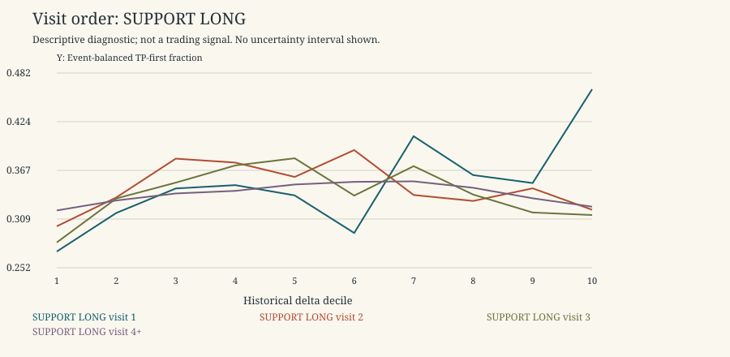

# Visit Order

Descriptive research only. 2021-2022 is primary research; 2023 is a previously inspected replication period, not untouched validation. No 2024 data, p-values, independence claims, threshold selection, scores or live trading. Rates exclude censored horizons; ambiguous outcomes remain ambiguous. Gross expectancy is conditional on unambiguous resolved horizons and excludes costs.

Period: 2021-2022 primary development

Display slice only: original half-width 0.004, TP=SL=0.003, horizon=8. Both types/directions remain separate. All widths and outcome combinations are in summary.csv/parquet. Empty/sparse buckets are retained and flagged, not promoted as discoveries.

The descriptive contrast below is decile 10 minus decile 1, not a selected trading region. Positive values do not establish significance.

| kind | direction | facet_value | unique_event_count_low | unique_event_count_high | high_minus_low_event_tp | high_minus_low_matched_increment |
| --- | --- | --- | --- | --- | --- | --- |
| RESISTANCE | LONG | 1 | 74 | 993 | 0.00657304 | 0.0789906 |
| RESISTANCE | SHORT | 1 | 74 | 993 | -0.100433 | -0.123201 |
| RESISTANCE | LONG | 2 | 352 | 826 | 0.02779 | 0.0878156 |
| RESISTANCE | SHORT | 2 | 352 | 826 | -0.0175682 | -0.072637 |
| RESISTANCE | LONG | 3 | 484 | 774 | 0.064733 | 0.14118 |
| RESISTANCE | SHORT | 3 | 484 | 774 | 0.0197909 | -0.114854 |
| RESISTANCE | LONG | 4+ | 4990 | 5445 | 0.0114553 | 0.070482 |
| RESISTANCE | SHORT | 4+ | 4990 | 5445 | 0.00730063 | -0.0465143 |
| SUPPORT | LONG | 1 | 979 | 93 | 0.191681 | 0.214627 |
| SUPPORT | SHORT | 1 | 979 | 93 | -0.0110053 | -0.0853024 |
| SUPPORT | LONG | 2 | 772 | 375 | 0.0194819 | -0.0179927 |
| SUPPORT | SHORT | 2 | 772 | 375 | -0.0395648 | -0.0248619 |
| SUPPORT | LONG | 3 | 764 | 494 | 0.0323516 | 0.068414 |
| SUPPORT | SHORT | 3 | 764 | 494 | 0.0161572 | 0.00725131 |
| SUPPORT | LONG | 4+ | 5053 | 5447 | 0.00445648 | 0.057976 |
| SUPPORT | SHORT | 4+ | 5053 | 5447 | 0.00546676 | -0.0464187 |

